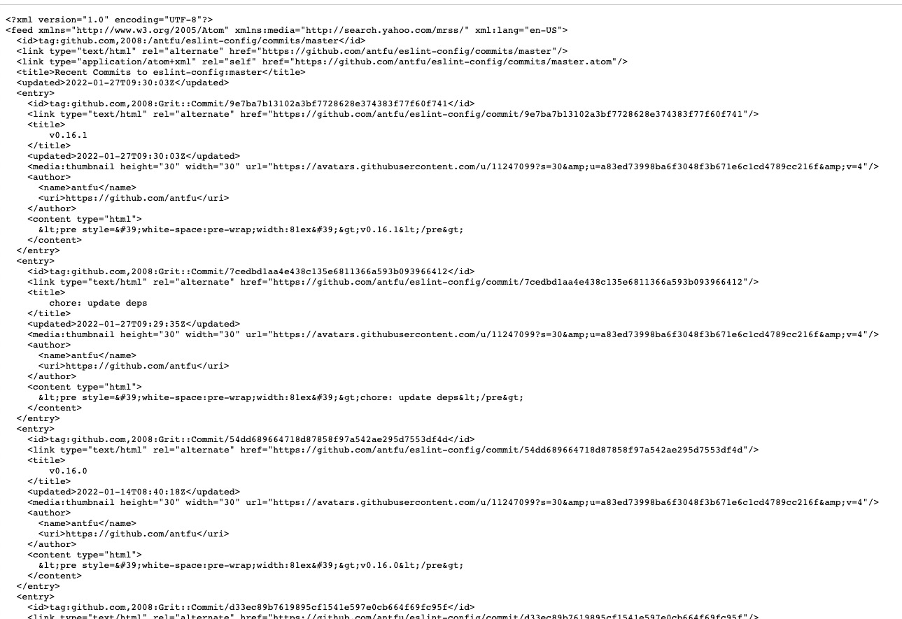
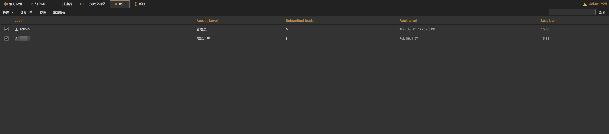
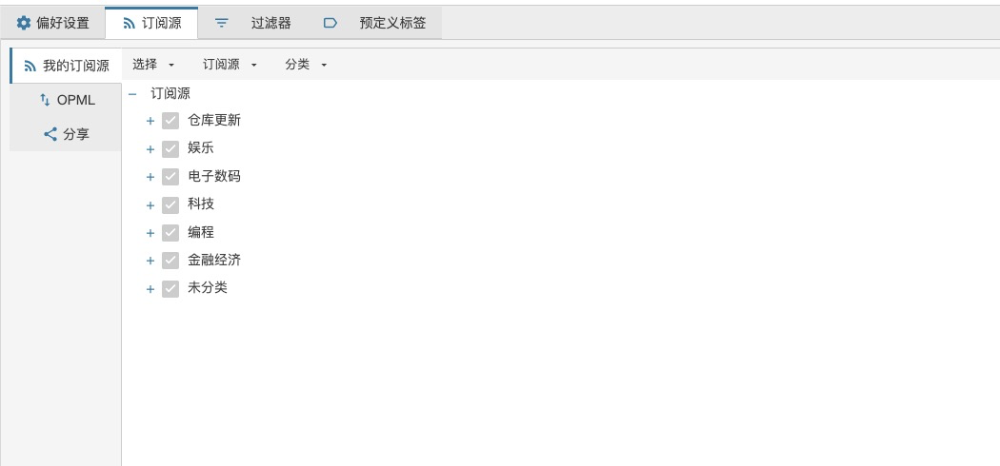
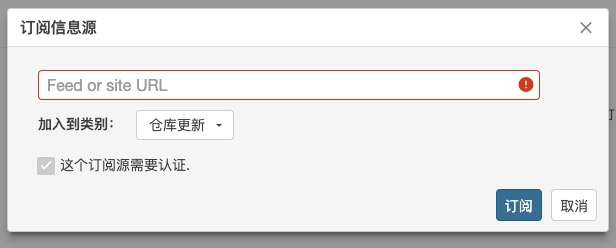
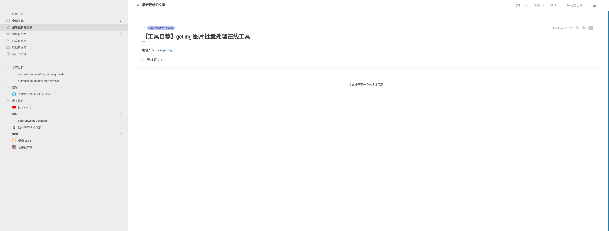
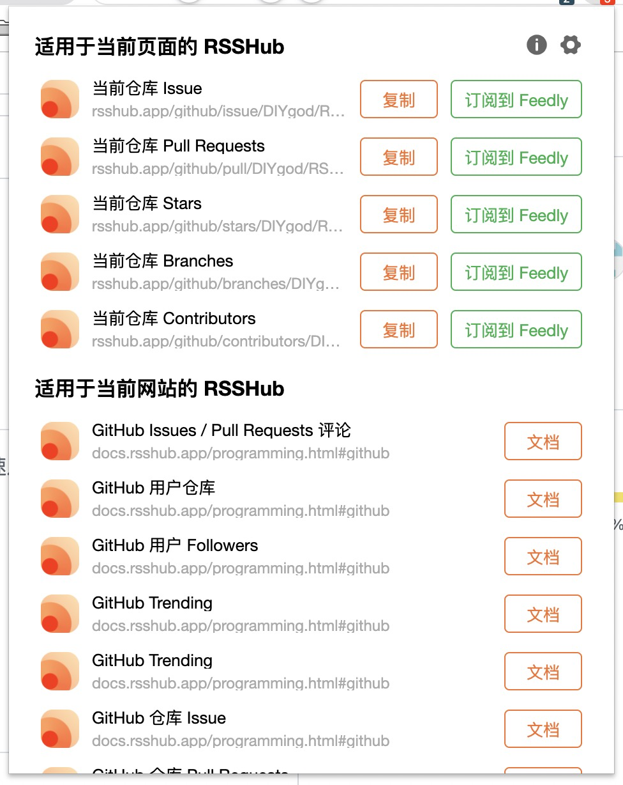
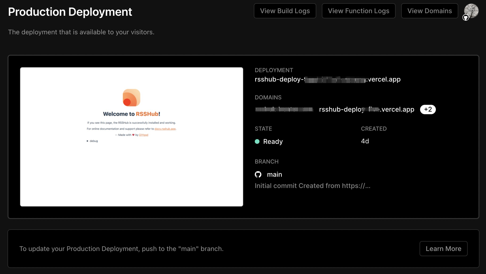

# Table of Contents

# **算法推荐带来了什么，带走了什么**

马克思说“人是社会关系的总和”，我们想获取更高质量的输入，就需要从不同渠道去与高水平的人建立关系，从不同渠道去获取高质量的信息。

在当前的 Web2.0 时代，每个人都可以在不同的地方发声，我们获取信息的渠道变得多种多样，例如公众号、博客、论坛、视频网站、问答社区等，为了降低获取信息的成本、提升信息的质量，一些技术手段也被应用在了信息获取上，比如算法推荐，它让搜索引擎更加强大，服务推送更加贴合用户。但在带来了一些好处的同时，它也带走了一些东西，比如下面的典型场景：

- 信息茧房：算法更倾向于推荐用户表现过感兴趣的内容，这可以达成更有效的推送，久而久之用户看见的内容会越来越局限在原本就感兴趣的内容里，造成个人视野的局限、加重群体极化、淡化社会黏性
- 杀时间：对于泛信息流类型的应用（比如抖音、微博、知乎），算法会持续供给一些好玩有趣的内容，以提高用户的粘性和使用时长，用户陷在算法之中浑然不觉，本来想稍微刷一刷或者只是为了了解某个主题，禁不住推送太花哨，一不注意时间就没了，却没有收获到太多高质量的信息，忘了自己最初打开应用是什么目的
- 剁手党：购物平台根据用户的画像，推送用户可能感兴趣的东西，持续吸引用户下单，时不时诱惑一下，用户终究忍不住下单，成为剁手党

特别是随着技术的发展和应用的成熟，算法推荐已经快随处可见，那么我们是否能在算法推荐之外再创造一片“净土”，构建一个完全由自己管理的信息流？这就是今天要分享的主题 —— RSS。

# **RSS 是什么**



一个典型的 RSS 订阅源数据格式

**RSS** 原意为资源描述框架站点摘要（RDF Site Summary），后演变为简易信息聚合（Really Simple Syndication），是一种消息来源格式规范，用以聚合网站内容更新。RSS 作为早期互联网的产物，随着互联网巨头的快速崛起、信息壁垒的建立，并以 2013 年 7 月 15 日 Google Reader 的服务终止为节点，作为一种「过时」技术濒临消亡。但幸运的是，RSS 在互联网浪潮的冲击下，虽然经历了式微的低谷，依然有一批信仰互联网精神的用户坚守到迎来复兴。

它和算法的本质区别在于：**RSS 是信息消费者主导的「主动信息聚合」，算法是信息生产者主导的「被动信息聚合」。** 而这，正是选择之争。

我们常见的信息来源可能有这些：

- **传统媒体 / 新媒体** （纸媒官网、公众号等）
- **博客 / 论坛** （公司或团队博客、个人博客、贴吧、V2EX 等）
- **社交媒体** （Twitter、Instagram、微博、知乎、即刻等）
- **流媒体** （YouTube、Bilibili、Spotify、Netflix 等）
- **其他来源** （邮件通讯等）

通过 RSS 我们就可以将这些来源的信息过滤、聚合在一起，主动构建属于自己的信息流，有效地提交信息的质量。

# **RSS 的发展历史**

开始讲如何应用之前先介绍一下 RSS 的发展历史，主要是早期创造相关的内容，因为这里特别想提到一个人 [Aaron Swartz](https://zh.wikipedia.org/wiki/%E4%BA%9A%E4%BC%A6%C2%B7%E6%96%AF%E6%B2%83%E8%8C%A8#%E9%80%AE%E6%8D%95%E4%B8%8E%E8%B5%B7%E8%AF%89)，我们在场程序员应该都是他的作品的受益者，我们可以先看一下他的一部分作品或经历：

- W3C RDF(资源描述框架) 规范核心工作组成员
- 深度参与到 RSS1.0 规范的制定（印象里是 14 岁）
- Markdown 主要贡献者。Markdown 语法显著受他 16 岁开发的 atx 语言影响
- Reddit 联合创始人开放数据图书馆
- 求进会创始人 - 成功反对《禁止网络盗版法案》
- 由于拒绝认罪 FBI 的重罪指控，26 岁时在自己公寓内自缢身亡

这个老哥的信念是公共知识、信息和期刊是人类的共有财产，不应该被少数人掌握和利用。也是因为这个愿景，利用 MIT 的网络下载了大量的 JSTOR 出版社的图书资源想公开出来，恰逢当时美国有几例不良黑客事件，FBI 借机拿他“杀鸡儆猴”，控告了他五项重罪。

这期间保释出来以后又积极带领了反对《禁止网络盗版法案》的运动，因为这个法案损害了互联网的自由性，让网站岌岌可危，一个侵权声明就可以关停别人的网站。在成功阻止了这个由大多数参议员和大型企业主导的法案后，FBI 又给他上面的事情加了 9 项重罪，累计可能面临 50 年监禁加上 100 万美元罚款，除非他认罪才有机会减刑。最后压力过大在公寓里崩溃了。

有一部电影叫[《互联网之子》](https://movie.douban.com/subject/25785114/)是关于他的记录片，这个老哥从小学的年纪就用开始用计算机做了很多有意思的事情，很可惜英年早逝了，他的技术、信念、行动力都让人敬佩，我当时看完《互联网之子》也深受触动，所以这里讲 RSS 特地讲一下他，相当于一个小致敬。

# **部署自己的 RSS 服务**

讲完了故事，接下来讲讲实际的，我们能用到的 RSS 服务。像上面说的，谷歌 13 年停止运营 Google Reader 以后，RSS 技术其实已经濒临消亡了，因此剩下的为数不多的 RSS 服务免费的都不那么好用，都需要冲钱才能变得更强。这里我们可以选择直接冲钱，比如使用 feedly、inoreader 之类的 RSS 订阅服务，直接将各种信息源聚合在一起。我更推荐自己找一台服务器部署一个自己的服务，这会更加可控和有意思。我们可以选择部署一个 [Tiny Tiny RSS](https://tt-rss.org/) 服务，社区已经有了现成的部署方案 [Awesome-TTRSS](https://github.com/HenryQW/Awesome-TTRSS)，直接使用 docker-compose 就可以部署：

## **准备工作**

- 一台服务器（国内的话需要备案）
- 一个域名（使用国内服务器的话需要备案）

## **服务配置文件**

一、`docker-compose.yml`

这里我们使用 docker compose 来部署服务，因此先写一个 docker-compose.yml 文件：

```yaml
version: "3"
services:
  ttrss:
    image: wangqiru/ttrss:latest
    container_name: ttrss
    environment:
      - SELF_URL_PATH=https://rss.yourdomain.com/ # 换成你的域名
      - DB_PASS=password # 定义你的数据库密码
      - PUID=1000
      - PGID=1000
    volumes:
      - feed-icons:/var/www/feed-icons/
    networks:
      - public_access
      - service_only
      - database_only
    stdin_open: true
    tty: true
    restart: always

  mercury:
    image: wangqiru/mercury-parser-api:latest
    container_name: mercury
    networks:
      - public_access
      - service_only
    restart: always

  opencc: #
    image: wangqiru/opencc-api-server:latest
    container_name: opencc
    environment:
      - NODE_ENV=production
    networks:
      - service_only
    restart: always

  database.postgres:
    image: postgres:13-alpine
    container_name: postgres
    environment:
      - POSTGRES_PASSWORD=password # 数据库密码，同上
    volumes:
      - ~/postgres/data/:/var/lib/postgresql/data
    networks:
      - database_only
    restart: always

  caddy:
    image: caddy:2
    container_name: caddy
    restart: always
    ports:
      - 80:80
      - 443:443
    volumes:
      - ./Caddyfile:/etc/caddy/Caddyfile:ro
      - ./caddy-config:/config
      - ./caddy-data:/data
    networks:
      - public_access
    environment:
      - DOMAIN=https://rss.yourdomain.com # 换成你的域名
      - EMAIL=email@email.com # 换成你的邮箱，用于自动申请 SSL 证书
      - LOG_FILE=/data/access.log

volumes:
  feed-icons:

networks:
  public_access:
  service_only:
    internal: true
  database_only:
    internal: true
```

按照你自己的情况改掉上面有注释的几行配置

二、Caddyfile

[Caddy](https://caddyserver.com/) 是一个类似 Nginx 的 web 服务器，它相比 Nginx 更加简单易用，性能也不错，最大的特点是能够自动申请 SSL 证书，让我们的服务以 HTTPS 的形式透出。

```nginx
{$DOMAIN}:443 {
  log {
    level INFO
    output file {$LOG_FILE} {
      roll_size 10MB
      roll_keep 10
    }
  }

  # Use the ACME HTTP-01 challenge to get a cert for the configured domain.
  tls {$EMAIL}

  # This setting may have compatibility issues with some browsers
  # (e.g., attachment downloading on Firefox). Try disabling this
  # if you encounter issues.
  encode gzip

  # Proxy everything else to Rocket
  reverse_proxy ttrss:80 {
       # Send the true remote IP to Rocket, so that ttrss can put this in the
       # log, so that fail2ban can ban the correct IP.
       header_up X-Real-IP {remote_host}
  }
}

```

这一个文件不需要改，里面的占位符会自动根据 docker-compose.yml 里定义的环境变量替换。

在上述两个文件都配置好并放到同一个目录下后，可以手动运行

```bash
docker compose up -d
```

> 安装 docker: https://github.com/docker/docker-install
>
> 安装 docker compose: https://docs.docker.com/compose/cli-command/#install-on-linux

安装并启动完后，可以访问配置的域名，通过 `admin` 账户和前面设置的密码，以管理员用户登录，进行一些基本配置以及用户管理，创建一个自己使用的非管理员用户：



之后再以非管理员用户登录，就可以开始定制和使用了。

一、订阅源分类管理 - 进入“偏好设置”



二、订阅新的信息源到对应类别中



三、开始使用



RSS 订阅界面

## **移动客户端**

如果是安卓用户，推荐使用 [Feedly](https://feedly.com/) 客户端连接到自己的服务上。

如果是 IOS 用户，好像 [Feeder](https://feeder.co/) 和 [Reeder](http://reederapp.com/mac/) 都不错，不过没有实际使用过。

# **RSS 使用技巧**

以下是一些 RSS 的使用技巧，可以让 RSS 的使用变得更加顺滑。

## **RSSHub Radar**

很多时候，我们并不清楚各种来源的信息是否支持以 RSS 的方式订阅，或者一个网站里面有哪些内容可以订阅，比如 Github 是不是能订阅，有哪些内容可以订阅。

这里推荐一个工具 [RSSHub Radar](https://github.com/DIYgod/RSSHub-Radar)，这是一个浏览器扩展，通过它我们可以快速发现各种网站已有的订阅源，一般是网站自身提供的，或者社区里的爱好者贡献的。



Github 仓库的订阅源

## **RSSHub - 万物皆可 RSS**

如果一个网站没有现成可用的订阅源怎么办？我们可以借助 [RSSHub](https://docs.rsshub.app/) 这个开源项目，将任何信息源转换为 RSS 源，实现“万物皆可 RSS”。

### **创建示例**

在官方仓库的 `lib/routes` 路径下添加 js 脚本，就可以创建新的 RSS 路由，例如 [/lib/routes/bilibili/coin.js](https://github.com/DIYgod/RSSHub/blob/master/lib/routes/bilibili/coin.js)。以下是一些创建的示例，分为获取数据和将数据转换为指定的数据结构两步。

一、获取数据

- 从 API 接口获取数据

```jsx
// 发起 HTTP GET 请求
const response = await got({
  method: "get",
  url: `https://api.bilibili.com/x/space/coin/video?vmid=${uid}&jsonp=jsonp`,
  headers: {
    Referer: `https://space.bilibili.com/${uid}/`,
  },
})

const data = response.data.data // response.data 为 HTTP GET 请求返回的数据对象
// 这个对象中包含了数组名为 data，所以 response.data.data 则为需要的数据
```

- 从 HTML 中获取数据

```jsx
// 发起 HTTP GET 请求
const response = await got({
  method: "get",
  url: "https://www.douban.com/explore",
})

const data = response.data // response.data 为 HTTP GET 请求返回的 HTML，也就是简书首页的所有 HTML
const $ = cheerio.load(data) // 使用 cheerio 加载返回的 HTML
const list = $("div[data-item_id]")
// 使用 cheerio 选择器，选择带有 data-item_id 属性的所有 div 元素，返回 cheerio node 对象数组

// 注：每一个 cheerio node 对应一个 HTML DOM
// 注：cheerio 选择器与 jquery 选择器几乎相同
// 参考 cheerio 文档：https://cheerio.js.org/
```

- 使用 puppeteer 渲染页面获取数据

```jsx
// 使用 RSSHub 提供的 puppeteer 工具类，初始化 Chrome 进程
const browser = await require("@/utils/puppeteer")()
// 创建一个新的浏览器页面
const page = await browser.newPage()
// 访问指定的链接
const link = "https://sspai.com/series"
await page.goto(link)
// 渲染目标网页
const html = await page.evaluate(
  () =>
    // 选取渲染后的 HTML
    document.querySelector("div.new-series-wrapper").innerHTML
)
// 关闭浏览器进程
browser.close()
const $ = cheerio.load(html) // 使用 cheerio 加载返回的 HTML
const list = $("div.item") // 使用 cheerio 选择器，选择所有 <div class="item"> 元素，返回 cheerio node 对象数组
```

二、返回指定的数据格式

```jsx
ctx.state.data = {
  // 源标题
  title: `${name} 的 bilibili 投币视频`,
  // 源链接
  link: `https://space.bilibili.com/${uid}`,
  // 源说明
  description: `${name} 的 bilibili 投币视频`,
  //遍历此前获取的数据
  item: data.map(item => ({
    // 文章标题
    title: item.title,
    // 文章正文
    description: `${item.desc}<br>`,
    // 文章发布时间
    pubDate: new Date(item.time * 1000).toUTCString(),
    // 文章链接
    link: `https://www.bilibili.com/video/av${item.aid}`,
  })),
}

// 至此本路由结束
```

### **免费部署自己的 RSSHub**

RSSHub 是一个社区项目，其官方服务由各方赞助提供，因此订阅的人很多，官方服务的稳定性可能没有那么高。我们可以选择自行部署 RSSHub，生成自己的服务。

这里推荐一个免费易用的做法，直接利用 [Vercel](https://vercel.com/) 的 Serverless Function 部署 RSSHub。

点击这个[链接](https://vercel.com/import/project?template=https://github.com/DIYgod/RSSHub)，就可以一键实现服务的部署，部署成功后我们还可以配置一个自定义的域名，实现更方便的访问。



# **订阅源推荐**

- [https://issei.notion.site/issei/RSS-Source-RSS-1e1694d953ae4b529142b1128bfef084](https://www.notion.so/RSS-Source-1e1694d953ae4b529142b1128bfef084?pvs=21)

# **参考引用**

1. [基于 RSS 的信息体系构建](https://sspai.com/post/68486)
