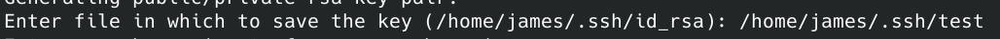

import Callout from "@components/Callout.astro"

# Table of Contents

为服务器的安全起见，最好将服务器配置成仅能用密钥登录，并关闭密码登录。本文介绍如何生成密钥然后配置到服务器里作为 ssh 连接的凭证。

# 生成密钥

```bash
ssh-keygen
```

第一个问题为，这里需要输入完整路径，包括密钥对的名称，不能使用 `~` 之类的别名:



后面两个问题是输入私钥的密码，重复相同密码输入即可:


完成之后我们可以在上面填写的路径下看到 `test` 和 `http://test.pub` 这对密钥对，其中 `test` 是私钥， `test.pub` 是公钥，这对密钥对需要保管好。

执行 `cat test.pub` 即可看到公钥的内容。

# SSH 登录配置

使用密码远程登录服务器后，即可对 SSH 登录方式进行配置：

```bash
vi /etc/ssh/sshd_config
```

找到如下几项后进行配置:

```bash
PubkeyAuthentication yes # 配置可以用公钥对应的密钥登录
AuthorizedKeysFile .ssh/authorized_keys .ssh/authorized_keys2 # 配置授权公钥的位置
PasswordAuthentication no # 配置不能使用密码登录
PermitRootLogin prohibit-password # 禁止用密码登录

# 保持连接的配置
# Server 每隔 60 秒发送一次请求给 Client，然后 Client响应，从而保持连接
ClientAliveInterval 60
# Server发出请求后，客户端没有响应得次数达到 10，就自动断开连接，正常情况下，Client不会不响应
ClientAliveCountMax 10
```

配置完成后，将上面公钥中的内容写入到 `~/.ssh/authorized_keys` 文件中，所有配置就完成了。

# 重启 SSH 服务

```bash
service ssh restart
```

<Callout text="注意这里是重启 ssh 服务，而不是 sshd 服务" />

这些都完成以后就仅能使用密钥进行 SSH 登录了，自己再妥善保管好这对密钥即可。

<Callout text="对于腾讯云的服务器，可以先 sudo passwd root 设置 root 账户的密码，并允许密码登录，再配置 ssh key 登录方便调试" />

参考引用:

> 1. [How To Configure SSH Key-Based Authentication on a Linux Server](https://www.digitalocean.com/community/tutorials/how-to-configure-ssh-key-based-authentication-on-a-linux-server)
> 2. [使用 SSH-Key 登录远程服务器](https://www.jianshu.com/p/fab3252b3192)
