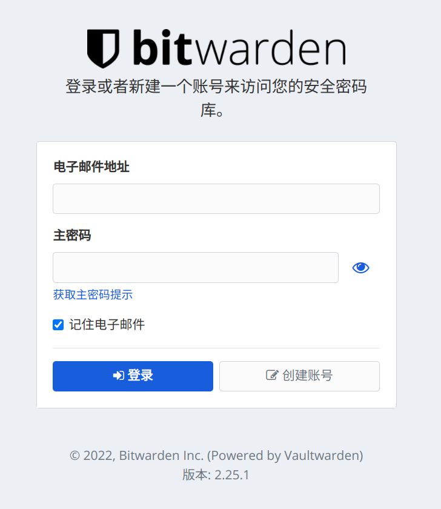
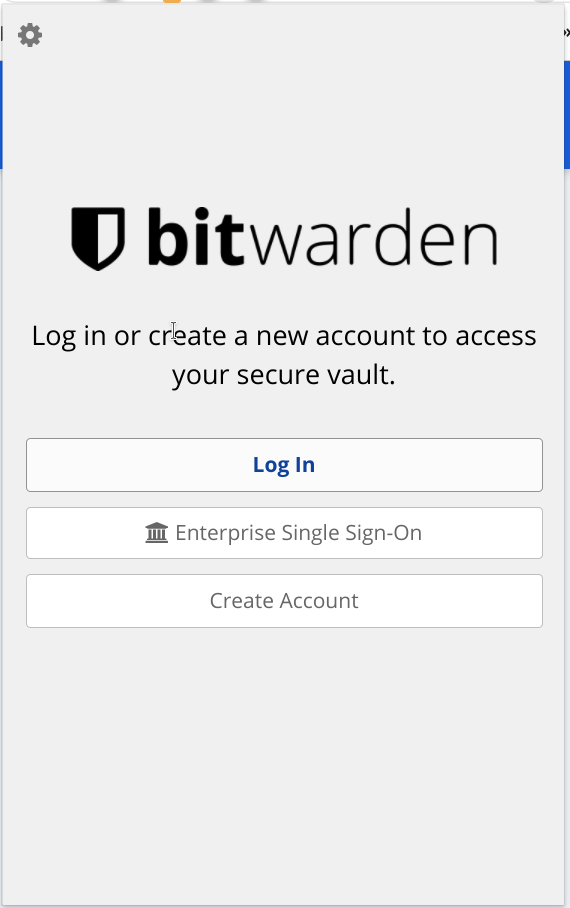
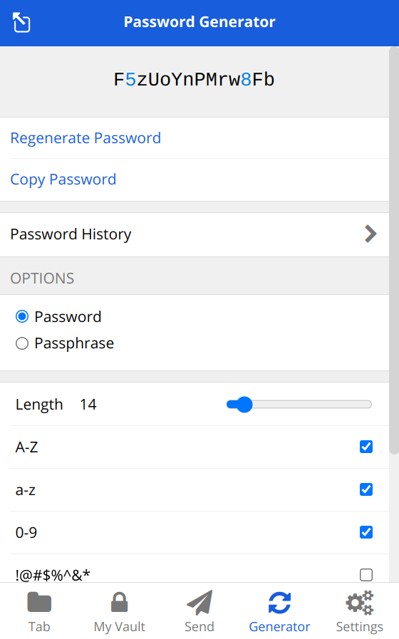
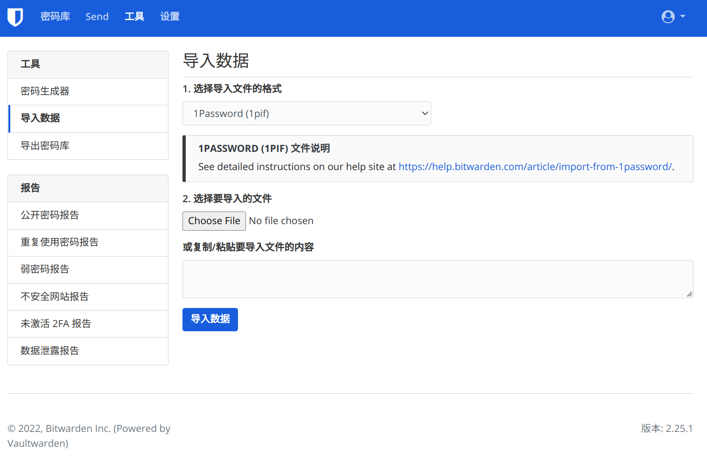
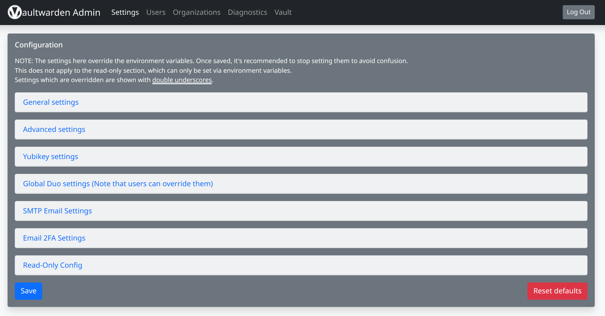

import Callout from "@components/Callout.astro"

# Table of Contents

# 什么是密码管理器

在使用许多网站、应用时，我们都需要用帐号密码来登录。帐号可能是手机号、邮箱或用户名，密码为了防止被盗以后所有帐号都被盗，一般也不建议只使用一个密码，需要在不同网站用不同的密码。

随着注册的网站越来越多，管理这些帐号密码就成了问题，因此前几年开始出现了一些密码管理器，它们在你登录网站或应用时会提示你要不要记住密码，在下次填写时会提示或者帮你补全之前记录过的帐号密码。

一些常见的密码管理器有 Chrome 浏览器的 Google 账户、安卓系统的“帐号与同步”。更加专业的密码管理器有 [1password](https://1password.com/), [lastpass](https://www.lastpass.com/), [bitwarden](https://bitwarden.com/) 等，它们有浏览器端、桌面端和移动端的客户端，可以全方位地为我们提供密码管理服务。

<Callout text="注意：建议银行、支付类的账户不要使用密码管理器来管理" />

# 为什么要自己部署密码管理器

既然已经有了各式各样的专业密码管理器，为什么我们这里要提到自己部署密码管理器呢？主要原因是为了密码服务的**安全和稳定**。如果我们不自己部署服务，而是直接使用现成的商业产品，试想以下情况：

- **密码管理器服务商被黑客攻击**：例如 [lastpass 最近的风波](https://www.cnbeta.com/articles/tech/1219927.htm)，如果这种情况发生密码就有泄漏的风险
- **密码管理器服务商提高价格**：大部分免费服务都有限制，例如 lastpass 免费账户不允许多个客户端同时登录，一旦超过限制就要付费，作为商业服务这是必然的，但一旦你依赖了服务商的产品，后续它再涨价到一个你不好接受的价格就要头疼了
- **密码管理器服务商停止运营**：云服务总有停止运营的一天，一旦使用的服务商宣布停止运营，免不了就要迁移到其它产品，而且服务商停止运营了它们会如何处理这些数据也无从可知

所以为了得到一个安全稳定的密码管理服务，我们可以自己部署一个密码管理器供我们自己或家人朋友使用，自己部署的服务可能价格稍微贵一点，但可以解决账户密码管理中的核心问题（安全、稳定），同时也能动手玩一些有趣的东西。

# 如何部署自己的密码管理服务

密码管理器由两部分组成，一个是数据和服务端，另一个是客户端，因此需要找一个数据和服务端可以由我们自己控制搭建，客户端现成可用的方案。

开源社区是一个宝库，最好找一个开源、主流的方案，上面提到的 [bitwarden](https://bitwarden.com/) 就是一个非常棒的选择。

## 为什么选择 bitwarden

- 数据和服务端可以自己控制和部署，有现成的客户端，并支持配置服务端地址
- [bitwarden 完全开源](https://github.com/bitwarden)，即使这个团队或公司不在了，我们也还可以用它的源码构建自己的服务端、客户端
- 开源社区有成熟的服务端实现([vaultwarden](https://github.com/dani-garcia/vaultwarden))可用 ，文档详尽、部署简单

## 准备工作

- 一台 512MB 内存以上的服务器(需要提前安装好 docker 和 docker-compose，方法见下方)
- 一个域名
- （可选）国内的服务器和域名需要提前备案，在国内可以买阿里云或腾讯云现成的服务器和域名，方便备案
- （可选）关系型数据库(例如 MySQL)，支持的数据库类型有：MySQL、PostgreSQL, SQLite

> **安装 docker**: [https://github.com/docker/docker-install](https://github.com/docker/docker-install) 执行 README 里的一键安装命令行
>
> **安装 docker-compose**: [https://docs.docker.com/compose/cli-command/#install-on-linux](https://docs.docker.com/compose/cli-command/#install-on-linux) 执行 “install on linux” 部分的几个命令行

## 配置和部署

一、增加一条域名解析记录，指向服务器 IP

假如买的域名为 `abc.xyz` ，可以增加一条 `password.abc.xyz` 的二级域名解析记录，指向服务器的 IP，这样访问 `password.abc.xyz` 就可以访问到我们的服务器

二、配置启动服务的 docker-compose.yml

在本地创建一个 `docker-compose.yml` 文件，并进行配置：

假设我们使用云服务厂商提供的远端数据库（**推荐这样做，因为远端数据库更加稳定且易于迁移和备份，以后需要部署到其它机器时也可以不做任何额外操作。目前云服务商的数据库在有活动时非常便宜，比如阿里云的 MySQL 数据库现在活动只要 50 多三年**），docker-compose.yml 文件配置如下，根据 `#` 后的注释说明，替换配置为自己的配置：

```yaml
version: "3"

services:
  vaultwarden:
    image: vaultwarden/server:latest
    container_name: vaultwarden
    restart: always
    env_file:
      - ".env"
    volumes:
      - "vaultwarden_vol:/data/"
    environment:
      - WEBSOCKET_ENABLED=true # Enable WebSocket notifications.
      ## Had issues when using single parentheses around the mysql URL as in the plain docker example
      - "DATABASE_URL=mysql://<数据库用户名>:<数据库用户密码>@<数据库公网地址>:<数据库端口>/<数据库名称>" # 将<>内容换成自己的，连同 <> 一起换掉
      - "ADMIN_TOKEN=<服务启动以后的后台管理密码>" # 不配置的话可以删除本选项，这样就没有后台管理功能，连同 <> 一起换掉
      - "RUST_BACKTRACE=1"

  caddy:
    image: caddy:2
    container_name: caddy
    restart: always
    ports:
      - 80:80 # Needed for the ACME HTTP-01 challenge.
      - 443:443
    volumes:
      - ./Caddyfile:/etc/caddy/Caddyfile:ro
      - ./caddy-config:/config
      - ./caddy-data:/data
    environment:
      - DOMAIN=<https://password.abc.xyz> # 这里需要换成你自己的域名，连同 <> 一起换掉
      - EMAIL=<email address> # 注册 HTTPS 证书的邮箱，填一个自己的邮箱就行，连同 <> 一起换掉
      - LOG_FILE=/data/access.log

volumes:
  vaultwarden_vol:
```

假如不想使用远端数据库，只想在服务器本地启用一个数据库存数据，可以使用如下的 docker-compose.yml 配置：

```yaml
version: "3.7"
services:
  mariadb:
    image: "mariadb"
    container_name: "mariadb"
    hostname: "mariadb"
    restart: always
    env_file:
      - ".env"
    volumes:
      - "mariadb_vol:/var/lib/mysql"
      - "/etc/localtime:/etc/localtime:ro"
    environment:
      - "MYSQL_ROOT_PASSWORD=<my-secret-pw>" # MySQL 数据库 root 用户的密码，自由设定，连同 <> 一起换掉
      - "MYSQL_USER=<vaultwarden_user>" # 密码管理数据库的用户名，连同 <> 一起换掉
      - "MYSQL_PASSWORD=<vaultwarden_pw>" # 密码管理数据库的用户密码，连同 <> 一起换掉
      - "MYSQL_DATABASE=vaultwarden"

  vaultwarden:
    image: "vaultwarden/server:latest"
    container_name: "vaultwarden"
    hostname: "vaultwarden"
    restart: always
    env_file:
      - ".env"
    volumes:
      - "vaultwarden_vol:/data/"
    environment:
      ## Had issues when using single parentheses around the mysql URL as in the plain docker example
      - "DATABASE_URL=mysql://<vaultwarden_user>:<vaultwarden_pw>@mariadb/vaultwarden" # 将上方配置的同名值填到此处，连同 <> 一起换掉
      - "ADMIN_TOKEN=<some_random_token_as_per_above_explanation>" # 服务启动以后的后台管理密码，不配置的话可以删除本选项，这样就没有后台管理功能
      - "RUST_BACKTRACE=1"
    ports:
      - "80:80"

  caddy:
    image: caddy:2
    container_name: caddy
    restart: always
    ports:
      - 80:80 # Needed for the ACME HTTP-01 challenge.
      - 443:443
    volumes:
      - ./Caddyfile:/etc/caddy/Caddyfile:ro
      - ./caddy-config:/config
      - ./caddy-data:/data
    environment:
      - DOMAIN=<https://password.abc.xyz> # 这里需要换成你自己的域名，连同 <> 一起换掉
      - EMAIL=<email address> # 注册 HTTPS 证书的邮箱，填一个自己的邮箱就行，连同 <> 一起换掉
      - LOG_FILE=/data/access.log

volumes:
  vaultwarden_vol:
  mariadb_vol:
```

三、配置 Caddy 服务

[Caddy](https://caddyserver.com/) 是一个开箱即用的 web 服务器，它最大的特点是可以自动帮我们申请域名对应的 HTTPS 证书，因为密码管理服务需要使用安全的 HTTPS 协议才能访问，否则即使启动了也无法使用，因此这里我们使用 Caddy 来反向代理得到 HTTPS 服务。

在本地创建一个 `Caddyfile` 文件，填入以下内容：

```
{$DOMAIN}:443 {
  log {
    level INFO
    output file {$LOG_FILE} {
      roll_size 10MB
      roll_keep 10
    }
  }

  # Use the ACME HTTP-01 challenge to get a cert for the configured domain.
  tls {$EMAIL}

  # This setting may have compatibility issues with some browsers
  # (e.g., attachment downloading on Firefox). Try disabling this
  # if you encounter issues.
  encode gzip

  # Notifications redirected to the WebSocket server
  reverse_proxy /notifications/hub vaultwarden:3012

  # Proxy everything else to Rocket
  reverse_proxy vaultwarden:80 {
       # Send the true remote IP to Rocket, so that vaultwarden can put this in the
       # log, so that fail2ban can ban the correct IP.
       header_up X-Real-IP {remote_host}
  }
}
```

四、将以上两个配置文件上传到服务器中

可以使用 [scp](https://www.computerhope.com/unix/scp.htm) 命令将本地的文件上传到服务器中，推荐创建一个类似 `~/password` 的独立目录，单独管理这些文件。也可以使用 Vim 创建、编写对应的文件，并将上面的内容复制粘贴进去。

五、启动服务

以上配置工作都完成以后，进入到两个配置文件所在的目录，然后运行 `docker compose up -d` 命令，就可以启动服务并连接数据库，这时候我们再访问自己设置的域名，比如例子中使用的 "https://password.abc.xyz" ，就可以看到一个类似这样的界面了：



## 如何更新

在服务器中运行如下命令：

```bash
docker pull vaultwarden/server:latest # 拉取最新镜像

docker compose restart # 进入到 docker-compose.yml 的目录，执行此命令重启服务
```

## 如何启动和停止

在服务器中运行如下命令：

```bash
# 进入到 docker-compose.yml 的目录，执行此命令启动服务
docker compose up -d

# 进入到 docker-compose.yml 的目录，执行此命令重启服务
docker compose restart

# 进入到 docker-compose.yml 的目录，执行此命令停止服务
docker compose stop

# 进入到 docker-compose.yml 的目录，执行此命令删除服务
docker compose rm

# 或者直接
docker compose down
```

## 如何卸载

按上述命令停止并移除服务后，删除服务器中的相关目录和文件，例如上面例子中的 `~/password` 目录。

<Callout text="以上内容在 vaultwarden 的 [Wiki](https://github.com/dani-garcia/vaultwarden/wiki) 文档里大多都有提到，如何还有疑惑可以查看 vaultwarden 的 [Wiki](https://github.com/dani-garcia/vaultwarden/wiki)。" />

# 如何使用

## 注册服务

访问我们在上面配置的域名，见到上图中的界面后，点击“创建帐号”就可以在我们自己的数据库里注册一个帐号。

## 客户端连接自持的服务端

一、下载客户端

[bitwarden](https://bitwarden.com/) 在浏览器、桌面端和移动端都有客户端，可以点击 [此页面](https://bitwarden.com/download/) 下载需要的客户端

二、客户端配置连接到自持的服务端

点击 bitwarden 客户端角落里的配置按钮，可以配置连接的服务端地址，填上我们之前配置的地址并保存：




三、用之前注册的帐号登录使用

登录后就可以使用 bitwarden 进行密码管理了。

## 为不同的网站生成不同的随机密码

借助 bitwarden 的 Generator 工具可以方便地以规则生成随机密码，这样在注册各种网站和应用时就可以使用完全不同的复杂密码也不用担心忘记：



## 从其它密码管理器里导入

如果之前是其它密码管理器的用户，bitwarden 还支持从其它密码管理器导入。

首先访问我们之前配置的域名，例如例子中的 `https://password.abc.xyz` ，登录自己的账户后，进入到”工具 - 导入密码”功能，就可以将其它密码管理工具导出的密码导入到自建的 bitwarden 中了：



## 后台管理

如果之前在 docker-compose.yml 中配置了管理员密码，那么访问 `/admin` 页面就可以进入后台管理页，进行一些后台管理操作，例如例子中的域名可以访问 `https://password.abc.xyz/admin` ，即可见到如下页面：


