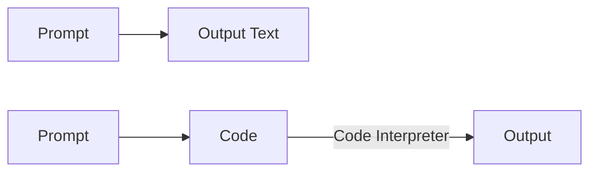

# Table of Contents

# Code Interpreter 是什么？

在前一段时间 ChatGPT Code Interpreter 推出后，大家应该都已经对它有了一些认识，知道它是什么、可以做什么，所以这里不再重复解释这些基础问题，这次我们换一个角度，从流程和要素的角度来看看怎么理解 Code Interpreter。



在常规的 ChatGPT 交互中，流程和要素是：Prompt => Output Text，这也是为什么 ChatGPT 刚推出的时候马上涌现出了 Prompt Engineering 的概念以及配套构建 Prompt 的 embedding 工作，因为它的流程短，要素简单，构造出一个好的 Prompt 就是这个流程中的关键。对于 Code Interpreter 来说，它的流程和要素是这样的：Prompt => Code \==Interpreter==> Output(Description, Image, File...)。这带来了一些变化：

1. Prompt 构造不再是直接面向输出，而是生成中间代码
2. 需要一个代码解释器，能够区分会话、执行代码，保存中间变量等
3. 输出变得更加多样，可以是图片、文件等

# 为什么要实现 Code Interpreter

ChatGPT 已经实现了 Code Interpreter，依托于 OpenAI 的 GPT 模型，能力也很强大，为什么还需要实现一个自己的 Code Interpreter？除了向行业领头羊看齐以及对接公司内部模型能力外，我们还可以想一下自己来实现会有什么增量。可以看到的典型增量有：

1. 能够与实时数据交互：ChatGPT 的 Code Interpreter 不具有 Plugins 的联网能力，开启 Code Interpreter 后就不能再选中 plugin，这导致 ChatGPT Code Interpreter 的数据实时性不足，不能做类似于“将 2023 年苹果公司的股市表现绘制成图”这样的事情
2. 能够与更多环境交互：本地或云端部署之后，就拥有了更自由的环境，无论是操作文件系统，还是调用 API，安装 ChatGPT Code Interpreter 不支持的包等，都成为了可能

# 实现 Code Interpreter 的思路

要实现 Code Interpreter 有两个核心关注点：一是借助模型能力，比如 OpenAI API 的 Function Calling 能力产出要调用的代码；二是拥有一个能执行 Python 代码的环境，例如用户指定要输出一个正弦函数图，那么需要得到绘制正弦函数图的代码，然后送到 Python 解释器中执行，输出图片然后展示给用户。在这个过程中 LLM Agent 可能还要对结果做一些解释和细节补充。此外还需要考虑文件 IO 以及会话中变量保存的能力。

如果用 LangChain 来实现的话，这会更加方便，这里 Python 解释器和文件 IO、变量保存都可以看作是 LangChain 的一个 Tool，把它塞到 LangChain 里 Agent Executor 里来调用。按照这个思路社区已经有了开源的实现：[codebox-api](https://github.com/shroominic/codebox-api/tree/main) ，可以把它注册成 LangChain Tool。除了提供代码执行的核心能力的 Tool，我们还需要一些周边来实现：会话管理、发起 Kernel 调用、文件 IO，即每当创建一个新的会话时，就创建一个新的 Jupyter Kernel channel 来执行代码，之后将执行结果按照输出的类型分门别类反馈给用户，这一部分上面的 codebox-api 的作者也把它封装成了解决方案：[codeinterpreter-api](https://github.com/shroominic/codeinterpreter-api)。

# 实现 Code Interpreter 的设计

接下来是对 codeinterpreter-api 项目的梳理拆解，看下具体怎么设计和实现上述的思路。由于项目主要是用 LangChain 来编排整个流程的，这里先补充说明一下项目用到 LangChain 部分的基础概念：

## LangChain 中的部分基础概念：

- LangChain Agents：LangChain 中的一个基础模块，核心思想是用 LLM 来选择要采取的一系列动作。与硬编码在链（chains）中的动作序列不同，代理（agents）使用语言模型作为推理引擎来决定要采取的动作及其顺序。
- LangChain Tools：Tools 是 Agent 调用的能力。主要有两个方面需要考虑：给 Agent 提供正确的工具，并以对 Agent 最有帮助的方式描述这些工具。在面向 Code Interpreter 创建自定义 StructuredTool 时需要定义：name, description, func(同步调用的函数), coroutine(异步调用的函数), args_schema(输入的 schema)
- LangChain Agent Executor：Agent Executor 是 Agent 的运行时。它实际上调用 Agent 并执行它选择的动作。这个执行器还做了一些额外的降低复杂性的工作，例如处理：Agent 选择不存在的 Tool、Tool 出错、Agent 产生无法解析为 Tool 调用的输出等情况

## 流程设计与实现

在有了上述基础概念之后，就可以来看怎么基于 LangChain Agent 实现 Code Interpreter 了，我们通过下面这段代码来看具体的执行流程：

```python
from codeinterpreterapi import CodeInterpreterSession, File

async def main():
    # context manager for start/stop of the session
    async with CodeInterpreterSession(model="gpt-3.5-turbo") as session:
        # define the user request
        user_request = "Analyze this dataset and plot something interesting about it."
        files = [
            File.from_path("examples/assets/iris.csv"),
        ]
        # generate the response
        response = await session.generate_response(user_request, files=files)
        # output the response (text + image)
        response.show()

if __name__ == "__main__":
    import asyncio
    # run the async function
    asyncio.run(main())
```

效果如图所示：


### 执行环境和工具实例化

通过 `with` 创建 session 时，就要开始实例化 jupyter kernel 以及 agent executor，以下是一些关键的步骤：

1. 通过 `jupyter-kernel-gateway` 创建与 Jupyter kernel 通信的服务并检测启动成功的状态

```python
self.jupyter = await asyncio.create_subprocess_exec(
	python,
	"-m",
	"jupyter",
	"kernelgateway",
	"--KernelGatewayApp.ip='0.0.0.0'",
	f"--KernelGatewayApp.port={self.port}",
	stdout=out,
	stderr=out,
	cwd=".codebox",
)
self._jupyter_pids.append(self.jupyter.pid)

# ...
while True:
	try:
		response = await self.aiohttp_session.get(self.kernel_url)
		if response.status == 200:
			break
	except aiohttp.ClientConnectorError:
		pass
	except aiohttp.ServerDisconnectedError:
		pass
	if settings.VERBOSE:
		print("Waiting for kernel to start...")
	await asyncio.sleep(1)
await self._aconnect()
```

指定 stdout 和 stderr，同时记录进程 pid 以及将这个 kernel 实例关联到 session 上。在 kernel 创建好以后，再发送 HTTP 请求，建立与 kernel 之间的 websocket 连接。

2. 创建 Agent Executor

```python
def _agent_executor(self) -> AgentExecutor:
	return AgentExecutor.from_agent_and_tools(
		agent=self._choose_agent(),
		max_iterations=9,
		tools=self.tools,
		verbose=self.verbose,
		memory=ConversationBufferMemory(
			memory_key="chat_history",
			return_messages=True,
			chat_memory=self._history_backend(),
		),
	)

def _choose_agent(self) -> BaseSingleActionAgent:
	return (
		OpenAIFunctionsAgent.from_llm_and_tools(
			llm=self.llm,
			tools=self.tools,
			system_message=code_interpreter_system_message,
			extra_prompt_messages=[
				MessagesPlaceholder(variable_name="chat_history")
			],
		)
		# ...
	)

def _tools(self, additional_tools: list[BaseTool]) -> list[BaseTool]:
	return additional_tools + [
		StructuredTool(
			name="python",
			description="Input a string of code to a ipython interpreter. "
			"Write the entire code in a single string. This string can "
			"be really long, so you can use the `;` character to split lines. "
			"Variables are preserved between runs. ",
			func=self._run_handler, # 调用 CodeBox 同步执行
			coroutine=self._arun_handler, # 调用 CodeBox 异步执行
			args_schema=CodeInput,
		),
	]
```

这里定义了使用 OpenAIFunctionsAgent，有需要我们可换成自己的 Agent，只是现在只有 OpenAI 的 API 有方便又强大的 Function Calling 能力，所以我们以这个举例。这里还同时指定了 Agent 以及 Agent Executor 会用到的 Tool，Tool 的定义包含名称和描述以及其它用于执行 python 代码的参数，其中上一步创建的 jupyter kernel 实例被 CodeBox 做了进一步封装，再作为同步和异步调用方法传递到 Tool 中。

### 处理输入的文本和文件

因为 Prompt Engineering 是一个可以外置的步骤，用户使用时应该将 Prompt 构建好再传进来，所以这一步框架本身没有做太多工作，只是将传入的文本和文件做了简单的 Prompt 追加（比如给到 LLM 用户指定了使用哪些文件），同时将文件记录到 CodeBox 实例中方便后续执行。

```python
class UserRequest(HumanMessage):
    files: list[File] = []

    def __str__(self):
        return self.content

    def __repr__(self):
        return f"UserRequest(content={self.content}, files={self.files})"

def _input_handler(self, request: UserRequest) -> None:
	"""Callback function to handle user input."""
	if not request.files:
		return
	if not request.content:
		request.content = (
			"I uploaded, just text me back and confirm that you got the file(s)."
		)
	request.content += "\n**The user uploaded the following files: **\n"
	for file in request.files:
		self.input_files.append(file)
		request.content += f"[Attachment: {file.name}]\n"
		self.codebox.upload(file.name, file.content)
	request.content += "**File(s) are now available in the cwd. **\n"
```

### 执行和结果处理

通过 Agent Executor，已经能够实现自动的 prompt 到 code 的转化，下面我们来看看这段代码具体怎么执行：

```python
def _connect(self) -> None:
	response = requests.post(
		f"{self.kernel_url}/kernels",
		headers={"Content-Type": "application/json"},
		timeout=90,
	)
	self.kernel_id = response.json()["id"]
	if self.kernel_id is None:
		raise Exception("Could not start kernel")

	self.ws = ws_connect_sync(f"{self.ws_url}/kernels/{self.kernel_id}/channels")
```

首先要通过 websocket 与特定的 kernel 进行连接，

```python
self.ws.send(
	json.dumps(
		{
			"header": {
				"msg_id": (msg_id := uuid4().hex),
				"msg_type": "execute_request",
			},
			"content": {
				"code": code,
				# ...
			},
			# ...
		}
	)
)
```

之后通过 websocket 将代码发送给 kernel 执行，

```python
while True:
    # ...
	if (
		received_msg["header"]["msg_type"] == "stream"
		and received_msg["parent_header"]["msg_id"] == msg_id
	):
		msg = received_msg["content"]["text"].strip()
		if "Requirement already satisfied:" in msg:
			continue
		result += msg + "\n"
		if settings.VERBOSE:
			print("Output:\n", result)

	elif (
		received_msg["header"]["msg_type"] == "execute_result"
		and received_msg["parent_header"]["msg_id"] == msg_id
	):
		result += received_msg["content"]["data"]["text/plain"].strip() + "\n"
		if settings.VERBOSE:
			print("Output:\n", result)

	elif received_msg["header"]["msg_type"] == "display_data":
		if "image/png" in received_msg["content"]["data"]:
			return CodeBoxOutput(
				type="image/png",
				content=received_msg["content"]["data"]["image/png"],
			)
		if "text/plain" in received_msg["content"]["data"]:
			return CodeBoxOutput(
				type="text",
				content=received_msg["content"]["data"]["text/plain"],
			)
		return CodeBoxOutput(
			type="error",
			content="Could not parse output",
		)
```

之后就是处理 channel message 中的一系列返回了：

- msg_type: stream，msg 中有 Requirement already satisfied: 则追加输出内容，继续等待 ws 返回
- msg_type: execute_result，将 `msg["content"]["data"]["text/plain"]` 追加到输出内容，继续等待
- msg_type: display_data，获取 `msg["content"]["data"]`，如果有 image/png，则把 png 包在 CodeBoxOutput 里返回，如果是 text/plain，同理返回。否则返回错误类型的输出，显示无法解析输出结果
- msg_type: status, execution_state: idle：代码执行成功但没有输出结果
- msg_type: error：直接报错

### 输出结果

在得到上述 `CodeBoxOutput` 输出后，就可以对输出进行处理了：对于文本类型的输出，不需要额外的处理，在运行过程中就通过 stdout 输出出来了；对于文件系统的操作，因为是通过 jupyter 直接进行的，所以也不需要在框架中额外处理，会自动落成本地的文件，直到需要对输出文件进行描述、解释，才需要做额外的处理。对于图片类型的输出，会在执行过程中将返回的图片 base64 保存在会话的 `out_files` 中，最后做输出处理时再转换为 Python 中标准的 Image 类型，之后通过 IPython 的 display 方法展示出来。

```python
def get_image(self):
    # ...
	img_io = BytesIO(self.content)
	img = Image.open(img_io)

	# Convert image to RGB if it's not
	if img.mode not in ("RGB", "L"):  # L is for greyscale images
		img = img.convert("RGB")

	return img

def show_image(self):
	img = self.get_image()
	# Display the image
	try:
		# Try to get the IPython shell if available.
		shell = get_ipython().__class__.__name__  # type: ignore
		# If the shell is in a Jupyter notebook or similar.
		if shell == "ZMQInteractiveShell" or shell == "Shell":
			from IPython.display import display  # type: ignore

			display(img)
		else:
			img.show()
	except NameError:
		img.show()
```

# 内部落地的设想

如果要在公司内部落地 Code Interpreter，以下是一些我们可以关注到的点：

1. 服务化或方案化
   1. 为平台已有模块提供基础执行能力或组件
   2. 给到内部需要做 Code Interpreter 的团队相关方案
2. 对接内部模型
3. 对接内部系统和环境，实现自动 API 调用
4. 支持非 LangChain 的开放技术栈

# 写在最后

这次只是从大体流程和设计上过了一下 Code Interpreter 的实现方案，但里面还有很多微小但重要的细节没有讨论到，比如：怎么在网页而不是本地进行输出、遇到执行报错后怎么反馈给模型重新生成代码、遇到依赖包未安装怎么自动安装然后重新执行等，这都是一个健壮的 Code Interpreter 必须要考虑和实现的东西，社区的方案目前也是 MVP 版本，对 edge case 的处理和考虑离实际生产应用还有一些差距，要实现一个完善、生产可用的 Code Interpreter，还有不少路要走，手还得弄得更脏些。
