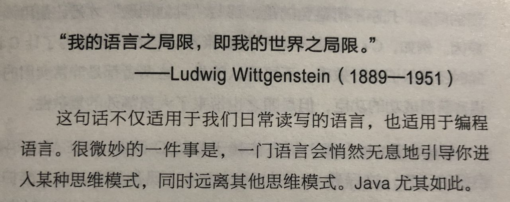

> To have another language is to possess a second soul.

查理曼大帝说: "To have another language is to possess a second soul." 掌握了第二门语言就相当于拥有了第二个灵魂，这说的是语言可以开阔人的思维和视野，同时反过来说，语言表达能力的不足也会导致我们的思维和视野受限。

我会有这个想法最初来源于滑到的一条推特，发推的人是谁忘记了(好像是耗子叔)，但保存了当时的图片，是一本 Java 书里的引言:

这里讲的是日常使用的计算机语言会限制人开发时的思维，使用不同语言的人有不同的思考方式和偏好，比如写惯了 Java 以后就习惯了用面向对象的思维去看问题和实现，而且没有 MVC 就非常不习惯，来了一个项目上来就是 MVC 开始干活。

在之后我又看到了一个 TED 演讲 [How language shapes the way we think | Lera Boroditsky](https://www.youtube.com/watch?v=RKK7wGAYP6k) (非常推荐观看)，里面讲了一些这样的例子：

- 一个语言里只有东南西北，没有左和右的民族会有特别好的地理方向感，因为他们经常要用东南西北来确定和描述路线；此外时间线的表达对他们来说不是从左到右或从右到左之类的，而总是与地理方向的从东到西一致，这意味着他们对时间线的观感有时有从左到右，有时从右到左，有时从远到近……
- 一个民族使用没有精确数量词，只有模糊量词的语言，就无法形成理工科学体系
- 对下图中发生的意外，英语的叙述习惯是说"这个人打坏了花瓶"，西班牙语的叙述习惯是说"花瓶碎了"。这会造成关注点的不同，前者更容易让我们记住是谁造成了意外，后者让我们更容易记住行为和意图

这些都是因为语言和表达不同，造成的对世界截然不同的思考和理解的方式。这促使我去想无论是自然语言还是编程语言此外还有比如编程框架、库的 API 设计、异步逻辑的处理等等，都可以看成是用既定规则在表达和描述问题，每个语言或框架都有它自己的表达习惯和风格，这种表达风格就代表了一种偏好或者说一种局限，当掌握的表达方式越少的时候，局限所在的范围就越小，因此**我的表达之局限，即我的世界之局限**，在局限之外的事物就相当于不存在我的世界里。因此想突破这种局限，就需要扩展表达的能力和方式，我自己定的两个小目标一个是加强英语听说能力，另一个是 JS 生态外的语言 F#，可以借此对函数式编程再多深入一点。
