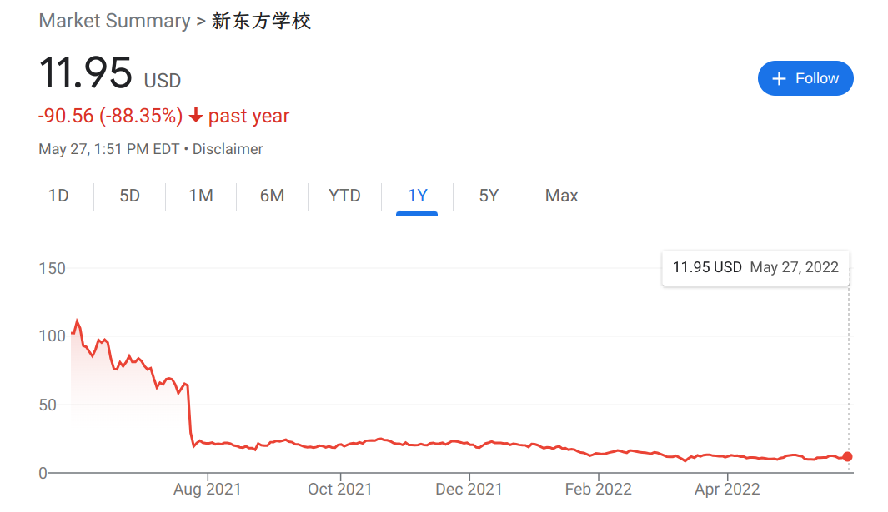
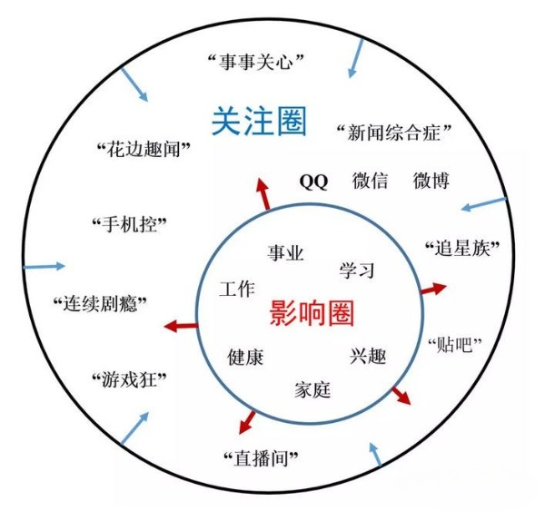

## Table of Contents

> "I’m a pessimist because of intelligence, but an optimist because of will." - [Antonio Gramsci](https://en.wikipedia.org/wiki/Antonio_Gramsci) in a Letter from Prison (December 1929)

标题中这句话出自于安东尼奥·葛兰西，因为看到这句话引起了我的思考，所以我对他做了一个简单的了解：他是一个马克思主义思想家，也是意大利共产党的创始人和领导人，标题中这句话出自他被捕入狱后在监狱中的写作。

Antonio 还创立了一个很有意思的理论 - [文化霸权理论](https://en.wikipedia.org/wiki/Cultural_hegemony)："一个社会阶层可以通过操纵社会文化（信仰、解释、认知、价值观等），支配或统治整个多元文化社会；统治阶级的世界观会被强制作为唯一的社会规范，并被认为是有利于全社会的普遍有效的思想，但实际上只有统治阶级受益。阶级都要透过其知识分子在公民社会争取到知性与道德上的领导权。"

这篇小文不讨论文化霸权，而是想聊聊“乐观”这件事。特别是目前大环境急转直下，到处人心惶惶之际，在社交网络上或者和朋友聊天的时候，都能感受到悲观情绪在四处弥漫。当宏观环境不尽人意的时候，个人的“乐观”就变得更加重要。

## 为什么要乐观

有一句话叫作“悲观者常常正确，但乐观者往往成功”，我们大多数人并不追求所谓成功，更多只是想经营好自己的生活，但我仍然从一些我佩服的人身上看到了乐观对他们的影响：

这是新东方教育集团近一年的股价走势，自政府打击 K12 教培行业以来，新东方的股价一泻千里，跌了将近 90%。

我之前读过新东方创始人俞敏洪老师的《我曾走在崩溃的边缘》，里面讲了新东方的艰难创业历程，在教培行业被打击后，有人调侃俞老师可以出一本续集了 -《我已崩溃》。因为我关注了俞老师的公众号，能看到他的一些动态，没想到的是他这个月真出了一本新书 -《在岁月中远行》，我第一时间买了来看，开篇自序的标题就是“在不确定的世界中，笃定前行”，我对这样的乐观大受震撼。因为之前偶尔会看到新东方的一些动态：新东方地面业务基本停止；新东方向农村学校捐赠 8 万套课桌椅；新东方裁员 6 万人，营收锐减 80%；新东方开启助农直播，尝试进行转型。这种程度的打击没有让他沉寂或者抱怨，而是写了一本大概率没多少人会关注到的新书，去讲远行、讲岁月、讲奋斗、讲对生命的热爱。可能这就是乐观对人最大的影响，让人能清醒坦然地接受不幸，然后坚信“新生”的到来，“沉舟侧畔千帆过，病树前头万木春”。

## 怎么才能乐观

我们把自己区别于其它动物称为高等生物，是因为我们具有一个根本性的特点，即在刺激和回应之间，可以不凭借本能，而是具有主动选择的自由，这意味着我们面对不如意的事情时，也可以主动选择乐观、学习如何乐观。下面聊聊我认为如何才能选择乐观：

### 影响圈和关注圈

有一个说法叫作“影响圈和关注圈”：影响圈就是可以影响我们、我们也能施加影响的圈子，关注圈就是我们投入了关注却不能产生影响或者受影响的圈子。

过度的悲观很多时候都缘于过分操心关注圈的事情，如果我们把心力收一收，专注在影响圈里，很容易就会发现事情并没有那么糟糕，甚至可能还一切向好，因此一个乐观的方法就是关心影响圈多一点，操心关注圈少一点。

### 理解它就不会过分担心

面对未知时，我们会有对未来不确定性的担忧，从而触发情绪化的恐惧本能。这种情况解决的办法很简单，就是去理解未知的东西，当事情理解了以后，即使再糟糕它的影响也是可预期的了，并且理解以后我们就不会对不幸的事情“小题大作”。比如现在经济形势不好，逆全球化、外资抽离、企业增长面临困境、社会发展缺乏更多想象力，如果想到这里就停了那难免会感到困扰，但我们还可以更进一步，尝试自己去理解一下这些问题。我为此找了一些简单的入门信息，比如[“经济机器是怎样运行的”](https://www.youtube.com/watch?v=rFV7wdEX-Mo)，看完以后我理解到经济的衰退并不是世界在倒退，而是过去信贷过于膨胀导致的，现在只是在填平过去埋下的坑，并且这是周期性的，具有客观规律。经济下行条件下，我要做的就是缩减当前的一些不必要开支，降低一些杠杆(比如买房多交点首付)，甚至有能力还可以买入一些好的资产，然后等待下一个增长周期的到来。我的理解可能不够深刻，但我为自己做了清楚、自洽的解释，这就足够了。

### 找到自己的乐趣

这一点很好理解，子曾经曰过：“一箪食，一瓢饮，在陋巷，人不堪其忧，回也不改其乐。”凡事如果能找到自己的乐趣点，便可以做到甘之如饴，这时候乐观是自发产生的，因为不管条件变得如何，自己都能从中得到快乐。

### 不要盲目乐观

当然乐观也是有边界的，盲目乐观并不可取。如果在某个场景下选择乐观后失败的代价很高，那么就不应该乐观，如果代价能够承受才应该选择乐观。比如酒驾显然就不是该乐观的事情。

## 结尾

未来是好是坏我们无法预料，就像当年改革开放之初，大家还在深夜里沉睡，直到黎明的光照进来，人们才被惊醒，然后开始欢呼赞叹，也许现在只是进入了下一个“乱纪元”的黄昏，黎明和黄昏总是交叉到来。既然如此不如乐观一点，“百年何足度，乘兴且长歌”。
