# Table of Contents

记录一些好用的命令行工具，一些是系统自带命令行或增强的替代品，另一些是让事情变得更加方便的小工具。

# 查找文件 - fd

通过文件名查找文件，速度快，使用简单，功能强大。

官网: [https://github.com/sharkdp/fd](https://github.com/sharkdp/fd)

安装方法: `cargo install fd-find`

使用方法: `fd <filename> <dir(optional)>`

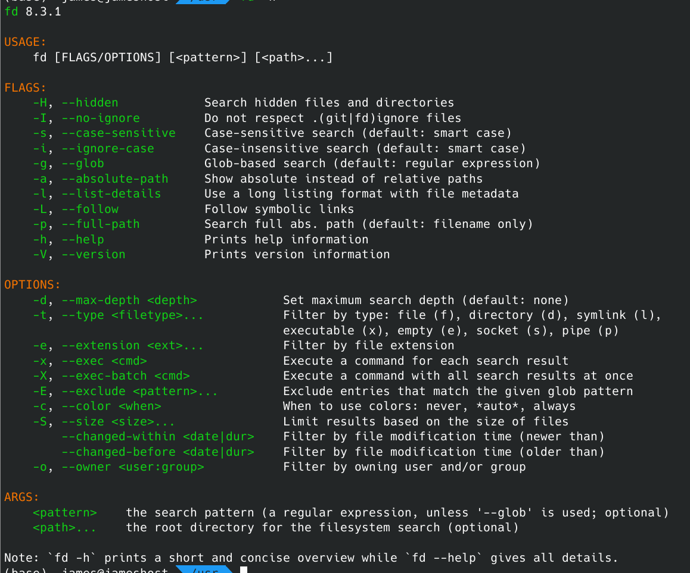

# 文件内容输出 - bat

替代 `cat` ，带有文本高亮，git 集成，行号等。

官网: [https://github.com/sharkdp/bat](https://github.com/sharkdp/bat)

安装方法: `yay -S bat` (Arch Linux) / `brew install bat` (MacOS)

使用方法: `cat <filename>`

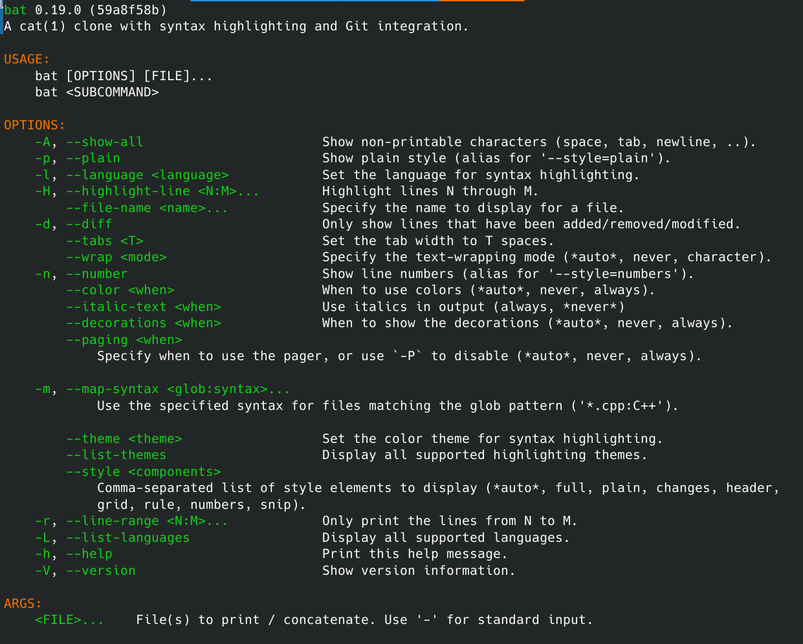

# 文件内容搜索 - rg

搜索文本、文件的内容。速度快，使用简单，功能强大。可以快速找到一个目录里什么文件包含特定文本。搜索结果里还会提供路径和结果所在的行数，非常好用。

官网: [https://github.com/BurntSushi/ripgrep](https://github.com/BurntSushi/ripgrep)

安装方法: `cargo install ripgrep`

使用方法:

`rg <filecontent pattern> <path(optional)>` / `ll /usr/bin | rg <filename pattern>`

如果搜索文本之间有空格可以加一个引号，例如 `rg 'file content'` 。

如果要搜索 ignored 目录中的内容，例如 node_modules，可以通过 `rg --hidden --no-ignore 'file content' <path>` 形式进行搜索。

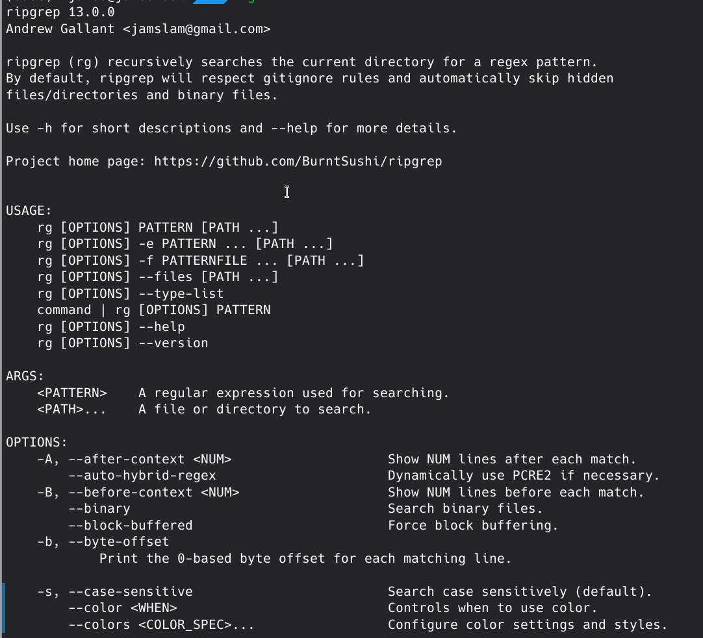

# 快速启动 Web Server - ws

这是一个 npm 包，使用它可以快速启动一个 web server，将本地的静态资源文件 serve 起来，同时它支持启动以 https server 的形式启动，并且不需要配置证书，对于将网站静态资源重定向到本地开发、调试的场景非常方便。

不过强制启用的 https server 需要手动访问一下 https 资源对应的地址，以解除浏览器的访问安全限制，如果想避免每次都遇到安全警告，可以参考这篇 [wiki](https://github.com/lwsjs/local-web-server/wiki) 创建并信任本地的证书。

官网: [https://github.com/lwsjs/local-web-server](https://github.com/lwsjs/local-web-server)

安装方法: `pnpm add -g local-web-server`

使用方法: `ws -p 8888 --https`

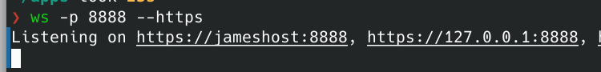

# 获取目录或文件的大小 - du

使用 `ls` 或 `ll` 命令是无法获取到某个目录下的总文件大小的，因此需要一个更好用的命令能让我们快速获取指定目录或文件的大小，对这种需求使用`du` 这个系统内置的命令就可以。(仅限 Linux 和 MacOS)

安装方法: Linux 和 MacOS 自带

官方手册: [https://man7.org/linux/man-pages/man1/du.1.html](https://man7.org/linux/man-pages/man1/du.1.html)

使用方法: `du -hs <path>` 其中 `-h` 表示 human readabel, `-s` 表示 summary。使用效果如下图:

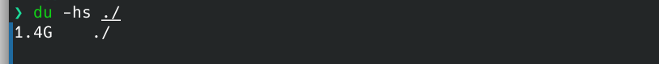

# 树形展示目录和文件结构 - as-tree

在讲解项目源码结构时比较有用，可以将目录里的文件以树的形式展现出来。配合本文提到的 `fd` 命令使用效果非常好。

官网: [https://github.com/jez/as-tree](https://github.com/jez/as-tree)

安装方法: `cargo install -f --git https://github.com/jez/as-tree`

使用方法: `fd -d 3 -t d | as-tree` 表示将深度为 3，类型为文件夹的所有文件和目录以树的形式展示出来，可以得到类似以下效果:

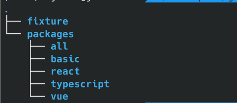

# 统计代码行数 - cloc

统计指定目录下的代码行数并分类。

官网: [https://github.com/AlDanial/cloc](https://github.com/AlDanial/cloc)

安装方法: `yay -S cloc` (Arch Linux) / `brew install cloc` (MacOS)

使用方法: `cloc <dir>`

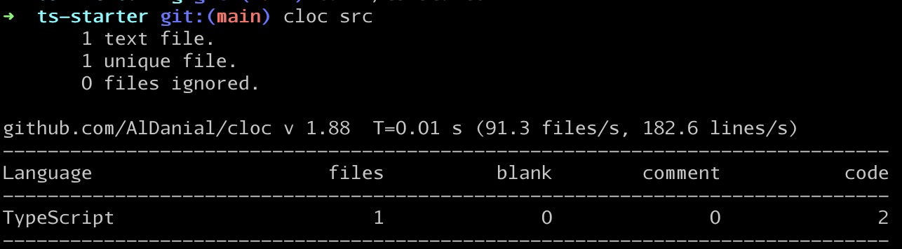

# 硬盘使用量查询 - duf

直观地查看硬盘使用情况。

官网: [https://github.com/muesli/duf](https://github.com/muesli/duf)

安装方法: `yay -S duf` (Arch Linux)/ `brew install duf` (MacOS)

使用方法: `duf`

效果:

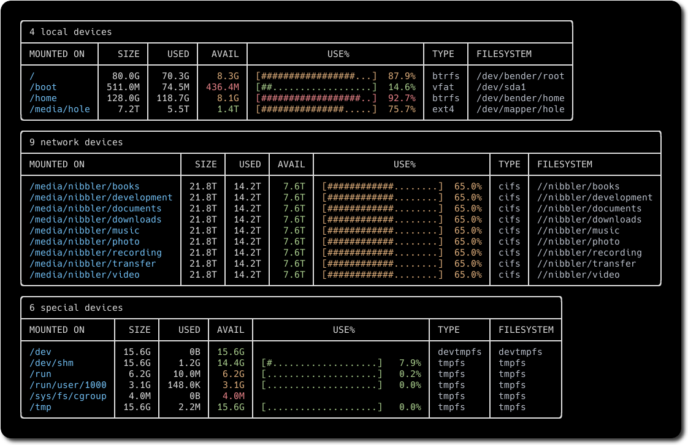

# Arch Linux 包管理工具 - yay

Arch Linux 系统的包管理工具 Pacman 的增强版。

官网: [https://github.com/Jguer/yay](https://github.com/Jguer/yay)

安装方法: [见官网](https://github.com/Jguer/yay#installation)

使用方法:

- 安装包: `yay -S <package name>`
- 更新包: `yay -Syu`
- 查询包: `yay -Q <package name>` 或者借助上面提到的 rg `yay -Q | rg <pattern>`
- 移除包: `yay -R <package name>`

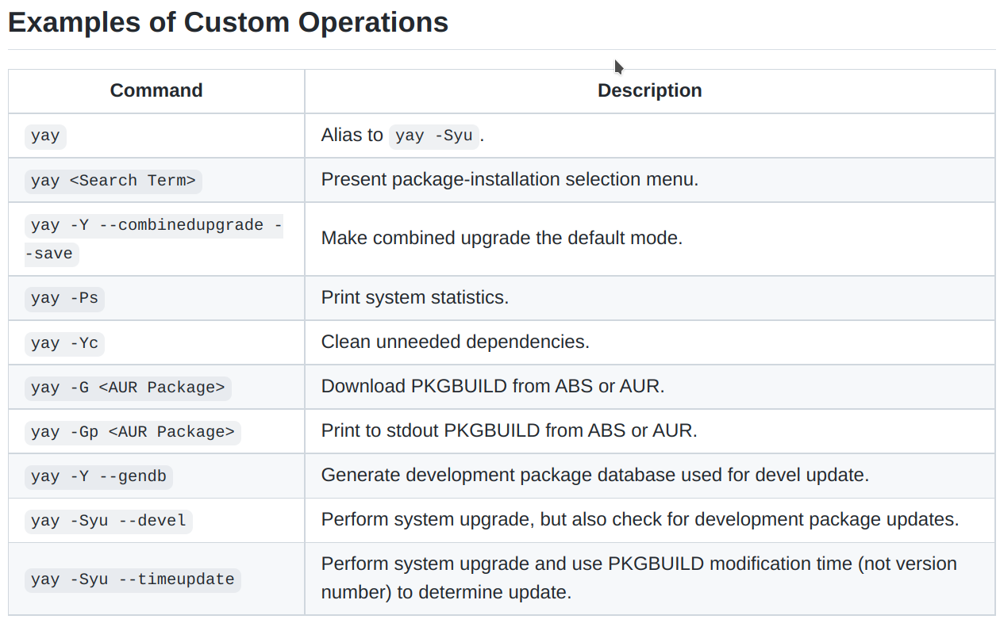

# Linux GUI 软件管理工具 - snap

在常用的 Linux 系统中，一些常见的 GUI 软件可能没法直接安装，snap 就是一个 GUI 软件管理工具，可以通过它安装许多常见的软件，例如 XMind, Spotify 等。

官网: [https://snapcraft.io/store](https://snapcraft.io/store)

安装方法: `yay -S snapd` (仅限于 Arch Linux 装包)

使用方法:

- 安装: `snap install <snap name>`
- 更新: `snap refresh <snap name>`
- 卸载: `snap remove <snap name>`

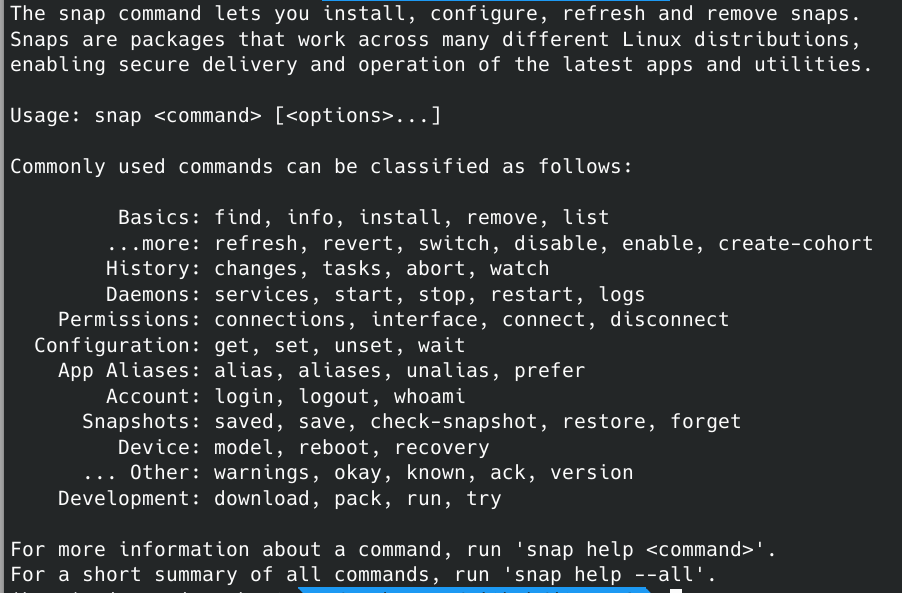

# 压缩解压 - tarfile

使用 python3 的 `tarfile` 模块，可以不用记住复杂的 `tar` 命令，非常简单进行压缩和解压。

使用方法:

- 压缩: `python3 -m tarfile -c test.tar.gz(或者 test.bz2, test.gz 等等) file1 file2`
- 解压: `python3 -m tarfile -e test.tar.gz`

# 另一个压缩解压 - ouch

无记忆成本、能力强大、体验好的压缩解压工具。

官网: [https://github.com/ouch-org/ouch](https://github.com/ouch-org/ouch)

安装方法：`yay -S ouch` (Arch Linux)/ `brew install ouch` (MacOS)

使用方法：

- 压缩: `ouch compress file1 file2 test.gz`
- 解压: `ouch decompress test.gz`
- 查看压缩文件内容: `ouch list test.gz`

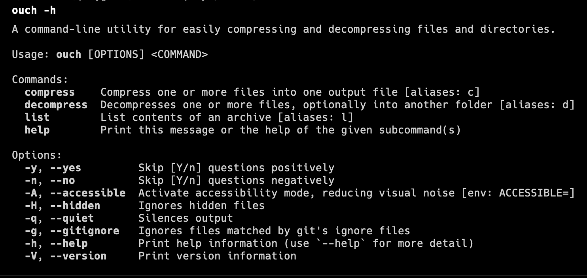
